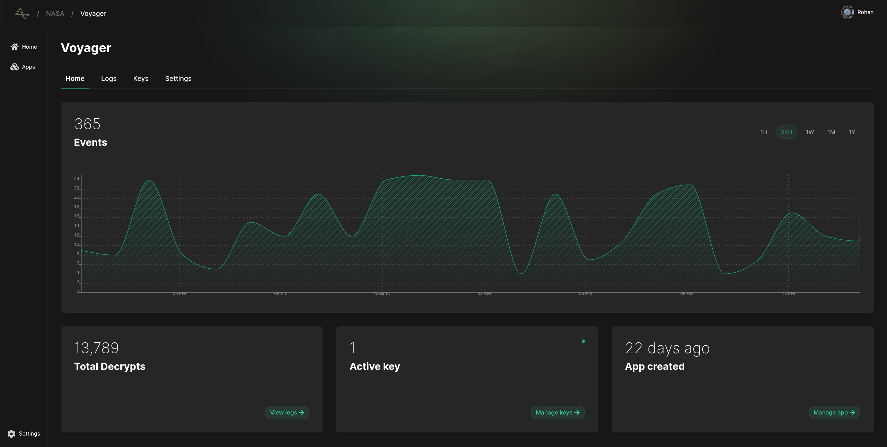
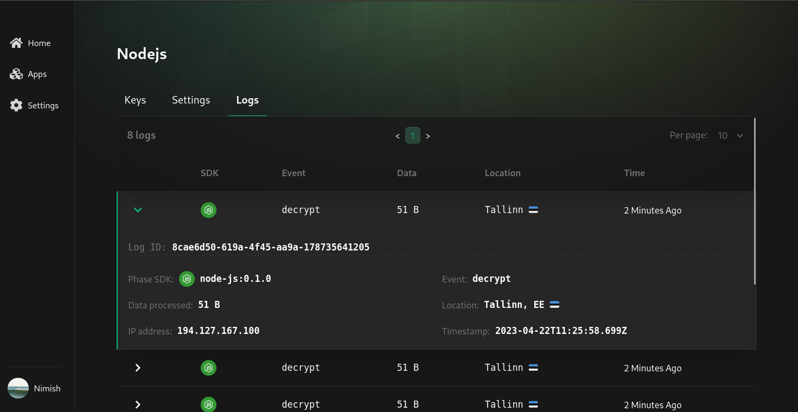
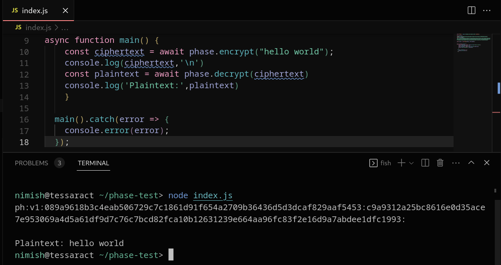

<h1>
  <table align="center" border="0">
    <tr>
      <td>
        
      </td>
      <td>
        Phase Console
      </td>
    </tr>
  </table>
    <h4 align="center">
  <a href="https://phase.dev">Website</a> |
    <a href="https://join.slack.com/t/infisical-users/shared_invite/zt-1kdbk07ro-RtoyEt_9E~fyzGo_xQYP6g">Slack</a> |
    <a href="https://phase.dev">Security</a> |
  <a href="https://docs.phase.dev">Docs</a>

  <h4>
</h1>
<p align="center">
  <p align="center">Open-source all in one encryption and key management platform for developers.</p>
</p>


<div style="display: flex; justify-content: space-between;">
    
    
</div>

<br>

## TL;DR

- 🔒 Crypto - Encrypt / decrypt data in your web apps with just 2 lines of code
- 🔑 Key management - Easily create, deploy and maintain control of your keys
- 📋 Observability - Monitor key usage with logs

Encrypt the signal, store the noise.

## Features

- **[Phase Console](https://console.phase.dev)**: Seamlessly create, manage and monitor keys securely to all your apps.
- **[Phase KMS](https://phase.dev)**: Securely deploy keys closer where your your apps run with [secret sharing](https://en.wikipedia.org/wiki/Secret_sharing).
- **[Client SDKs](https://docs.phase.dev/sdks)**: Encrypt data directly in the browsers of our users with 3 lines of code. [Live Demo](https://phase.dev/#use-cases)
- **[Server SDKs](https://docs.phase.dev/sdks)**: Securely decrypt and process data in memory only when you need to with 3 lines of code.
- **[Phase I/O]()**: Self-hosted EaaS (Encryption as a Service) and a transparent proxy encryption. (Coming Soon)

## Getting started

Check out the [Quickstart](https://docs.phase.dev/quickstart) Guides

### Use Phase Console Cloud

The quickest and most reliable way to get started is making a new free account on the [Phase Console](https://console.phase.dev/).

### Deploy Phase Console on premise (Coming soon)

Deployment options: WIP: [Docker]()

### Run Phase Console locally

** Insert instructions here **

### SDKs

- [JavaScript Browser](https://github.com/phasehq/client-js-sdk)

- [Node.js](https://github.com/phasehq/node-sdk)

- [Python](https://github.com/phasehq/python-sdk)

More coming soon!

Try the [demos](/demo/)
without setting up keys

```js
// Import & initialize
const Phase = require('@phase.dev/phase-node')
const phase = new Phase(APP_ID, APP_SECRET)

// Encrypt
const ciphertext = await phase.encrypt('hello world')

// Decrypt
const plaintext = await phase.decrypt(ciphertext)
console.log(ciphertext)
$ hello world
```

## Open-source vs. paid

This repo available under the [MIT expat license](https://github.com/phasehq/console/blob/main/LICENSE), with the exception of the `ee` directory which will contain premium Pro or Enterprise features requiring a Phase license in the future.

## Security

For more information of how Phase encryption works, please see the [Security Docs](https://docs.phase.dev/security/overview)

Please do not file GitHub issues or post on our public forum for security vulnerabilities, as they are public!

For more information see: [SECURITY.md](/SECURITY.md)

## Contributing

Whether it's big or small, we love contributions. See [CONTRIBUTING.md](/CONTRIBUTING.md)

You can join our [Slack](https://join.slack.com/t/phase-community/shared_invite/zt-1tkwzl31z-a6yCB5Uqlj~V2x43ep2Evg) if you have any questions!

## Resources

- [Website](https://phase.dev)
- [Docs](https://docs.phase.dev)
- [GitHub](https://github.com/phasehq/console)
- [Slack](https://join.slack.com/t/phase-community/shared_invite/zt-1tkwzl31z-a6yCB5Uqlj~V2x43ep2Evg)
- [System Status](https://phase.statuspage.io)
