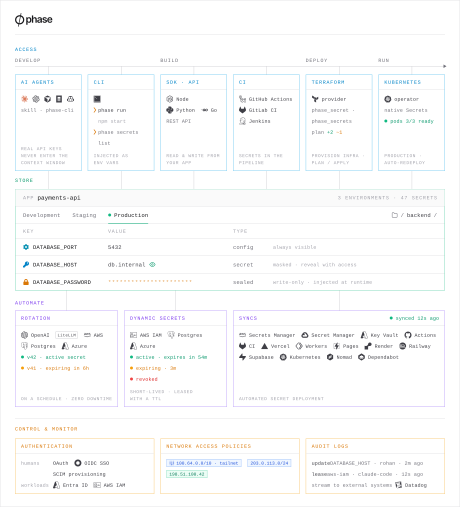

<a href="https://docs.phase.dev">
  <picture>
    <source media="(prefers-color-scheme: dark)" srcset="img/phase-platform-dark.svg">
    <source media="(prefers-color-scheme: light)" srcset="img/phase-platform-light.svg">
    
  </picture>
</a>

---

## Community vs Enterprise edition

Phase operates on an [open-core](https://en.wikipedia.org/wiki/Open-core_model) model, similar to that of [GitLab](https://gitlab.com).

This repo is available under the [MIT expat license](/LICENSE), with the exception of the `ee` directory which will contain Pro or Enterprise features requiring a Phase license.

---

## Security

For more information on how Phase encryption works, please see the [Security Docs](https://docs.phase.dev/security)

Please do not file GitHub issues or post on our public forum for security vulnerabilities, as they are public!

For more information see: [SECURITY.md](/SECURITY.md)

---

## Contributing

We love contributions. See [CONTRIBUTING.md](/CONTRIBUTING.md)

You can join our [Slack](https://slack.phase.dev) if you have any questions!
