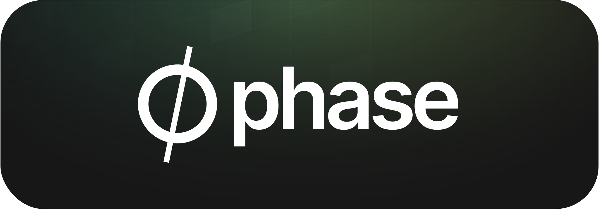

<div align="center">
  <!-- Phase Console -->
  <a href="https://phase.dev">
  
  </a>

  <a href="https://phase.dev">Website</a> |
  <a href="https://docs.phase.dev">Documentation</a> |
  <a href="https://docs.phase.dev/security">Security</a> |
    <a href="https://github.com/phasehq/console/blob/main/CONTRIBUTING.md">Contributing</a> |
  <a href="https://slack.phase.dev">Join Slack</a>
</div>

---

Open source platform for fast-moving engineering teams to secure and deploy application secrets — from development to production.

A developer-friendly alternative to **HashiCorp Vault** and **AWS Secrets Manager** that works with your whole team 🧑‍💻.

---

# Phase Console


|     | **Features**                                                                                                                                                |
| --- | ----------------------------------------------------------------------------------------------------------------------------------------------------------- |
| 📈  | **[Phase Console](https://console.phase.dev)**: Dashboard for seamlessly creating, managing, rotating secrets, and environment variables                |
| ⌨️  | **[CLI](https://github.com/phasehq/cli)**: Import existing secrets from `.env` files, encrypt them, and securely inject them in your application at runtime  |
| 🤫  | **[Secret management](https://docs.phase.dev/console/apps)**: Secret Diffs, version control, and recovery                                                                                    |
| 🙋  | **[RBAC](https://docs.phase.dev/console/users#user-roles)**: Fine-grained, role-based, and cryptographic access control, per application, per environment.                                                      |
| 🔌  | **[Secret sync](https://docs.phase.dev/#integrate-phase)**: Automatically sync secrets to GitHub, Cloudflare Pages, Vercel, GitLab CI, Railway, AWS Secrets Manager, etc.                                                        |
|   | **[Kubernetes](https://docs.phase.dev/integrations/platforms/kubernetes)**: Automatically deploy secrets to your Kubernetes Cluster via the Phase Secrets Operator   |
|     | **[Terraform](https://docs.phase.dev/integrations/platforms/hashicorp-terraform)**: Manage secrets in your HashiCorp Terraform Iac workflows. |
| ⛓️  | **[Secret referencing & overrides](https://docs.phase.dev/console/secrets)**: Create personal secrets. Inherit values from other secrets                                                              |
| 🌐  | **[REST API](https://docs.phase.dev/public-api/secrets#get-secrets)**: Access and manage secrets programmatically                                                                                      |
| 📦  | **[SDKs](https://docs.phase.dev/sdks)**: SDKs for integrating Phase with various programming languages and frameworks              
| 🥡  | **[Self Hosting](https://docs.phase.dev)**: Run Phase on your own infrastructure                                                                            |
| 🔍  | **[Audit Logs]()**: Complete visibility into every change and access event                                                                                  |                                                                        |                                                                                |

[Explore Phase Console](https://docs.phase.dev/console)

---

## CLI - Import, Encrypt and Inject secrets


```fish
λ phase --help
Securely manage application secrets and environment variables with Phase.

           /$$
          | $$
  /$$$$$$ | $$$$$$$   /$$$$$$   /$$$$$$$  /$$$$$$
 /$$__  $$| $$__  $$ |____  $$ /$$_____/ /$$__  $$
| $$  \ $$| $$  \ $$  /$$$$$$$|  $$$$$$ | $$$$$$$$
| $$  | $$| $$  | $$ /$$__  $$ \____  $$| $$_____/
| $$$$$$$/| $$  | $$|  $$$$$$$ /$$$$$$$/|  $$$$$$$
| $$____/ |__/  |__/ \_______/|_______/  \_______/
| $$
|__/

options:
  -h, --help   show this help message and exit
  --version, -v
               show program's version number and exit
Commands:

    auth             💻 Authenticate with Phase
    init             🔗 Link your project with your Phase app
    run              🚀 Run and inject secrets to your app
    shell            🐚 Launch a sub-shell with secrets as environment variables (BETA)
    secrets          🗝️ Manage your secrets
    secrets list     📇 List all the secrets
    secrets get      🔍 Get a specific secret by key
    secrets create   💳 Create a new secret
    secrets update   📝 Update an existing secret
    secrets delete   🗑️ Delete a secret
    secrets import   📩 Import secrets from a .env file
    secrets export   🥡 Export secrets in a dotenv format
    users            👥 Manage users and accounts
    users whoami     🙋 See details of the current user
    users switch     🪄 Switch between Phase users, orgs and hosts
    users logout     🏃 Logout from phase-cli
    users keyring    🔐 Display information about the Phase keyring
    docs             📖 Open the Phase CLI Docs in your browser
    console          🖥️ Open the Phase Console in your browser
    update           🆙 Update the Phase CLI to the latest version
```

[Explore Phase CLI](https://github.com/phasehq/cli)

---

## Getting started

Check out the [Quickstart](https://docs.phase.dev/quickstart) Guides

### Use Phase Cloud

The quickest and most reliable way to get started is by signing up on the [Phase Console](https://console.phase.dev/).

### Self-host Phase

|                                                                                                                                                                                                                                                                                                                                                                                                                                                                                                                                                                                                                                                                                                                                                                                                                                                                                                                                                                                                                                                                                                                                                                                                                                                                                                                                                                                                                                                                                                                                                                                                                                                                                                                                                                                                                                                                                                                                                                                                                                                                                                                                                                                                                                                                                                                                                                                                                                                                                                                                                                                                                                                                                                                                                                                                                                                                                                                                                                                                                                                                                                                                                                                                                                                                                                     | **Deploy Phase Console on your infrastructure**                      |
| --------------------------------------------------------------------------------------------------------------------------------------------------------------------------------------------------------------------------------------------------------------------------------------------------------------------------------------------------------------------------------------------------------------------------------------------------------------------------------------------------------------------------------------------------------------------------------------------------------------------------------------------------------------------------------------------------------------------------------------------------------------------------------------------------------------------------------------------------------------------------------------------------------------------------------------------------------------------------------------------------------------------------------------------------------------------------------------------------------------------------------------------------------------------------------------------------------------------------------------------------------------------------------------------------------------------------------------------------------------------------------------------------------------------------------------------------------------------------------------------------------------------------------------------------------------------------------------------------------------------------------------------------------------------------------------------------------------------------------------------------------------------------------------------------------------------------------------------------------------------------------------------------------------------------------------------------------------------------------------------------------------------------------------------------------------------------------------------------------------------------------------------------------------------------------------------------------------------------------------------------------------------------------------------------------------------------------------------------------------------------------------------------------------------------------------------------------------------------------------------------------------------------------------------------------------------------------------------------------------------------------------------------------------------------------------------------------------------------------------------------------------------------------------------------------------------------------------------------------------------------------------------------------------------------------------------------------------------------------------------------------------------------------------------------------------------------------------------------------------------------------------------------------------------------------------------------------------------------------------------------------------------------------------------------- | -------------------------------------------------------------------- |
| | [Docker Compose](https://docs.phase.dev/self-hosting/docker-compose) |
|  | [AWS](https://docs.phase.dev/self-hosting/aws)                       |
|  | [Google Cloud Platform](https://docs.phase.dev/self-hosting/gcp)     |
|  | [Azure](https://docs.phase.dev/self-hosting/azure)                   |
| | [DigitalOcean](https://docs.phase.dev/self-hosting/digitalocean)     |
| 🥡                                                                                                                                                                                                                                                                                                                                                                                                                                                                                                                                                                                                                                                                                                                                                                                                                                                                                                                                                                                                                                                                                                                                                                                                                                                                                                                                                                                                                                                                                                                                                                                                                                                                                                                                                                                                                                                                                                                                                                                                                                                                                                                                                                                                                                                                                                                                                                                                                                                                                                                                                                                                                                                                                                                                                                                                                                                                                                                                                                                                                                                                                                                                                                                                                                                                                                  | [Self-hosting Phase](https://docs.phase.dev/self-hosting)            |

---

### SDKs

- [Golang](https://docs.phase.dev/sdks/go)
- [Node.js](https://github.com/phasehq/node-sdk)
- [Python](https://github.com/phasehq/python-sdk)

More coming soon!

---

## Community vs Enterprise edition

Phase operates on an [open-core](https://en.wikipedia.org/wiki/Open-core_model) model, similar to that of [GitLab](https://gitlab.com).

This repo is available under the [MIT expat license](/LICENSE), with the exception of the `ee` directory which will contain Pro or Enterprise features requiring a Phase license.

---

## Security

For more information on how Phase encryption works, please see the [Security Docs](https://docs.phase.dev/security)

Please do not file GitHub issues or post on our public forum for security vulnerabilities, as they are public!

For more information see: [SECURITY.md](/SECURITY.md)

---

## Contributing

We love contributions. See [CONTRIBUTING.md](/CONTRIBUTING.md)

You can join our [Slack](https://slack.phase.dev) if you have any questions!
